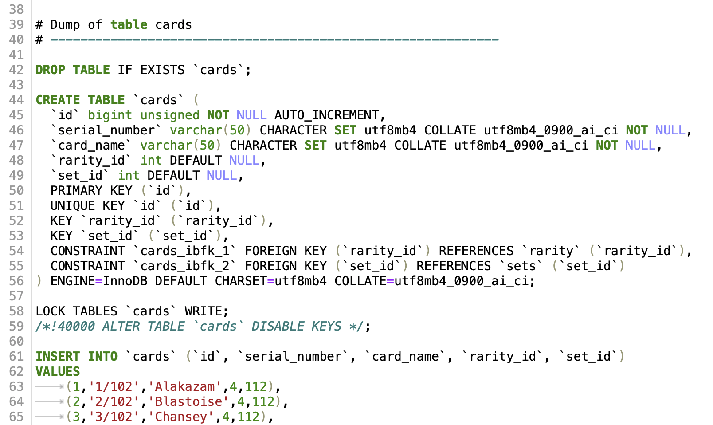

# Building a SQL Database 💾

## Introduction 📝

In this project, the goal is to create a new SQL database using MySQL and Sequel Ace, focusing on the fundamental concepts of primary keys, foreign keys, and best practices for Relational Database Management Systems (RDBMS). The chosen example for this project is the Pokemon Trading Card Game, providing a concrete context for understanding and implementing these important database concepts.

## Scraping Information 🕸️

The first step involves scraping information from the [Bulbapedia](https://bulbapedia.bulbagarden.net/wiki/Main_Page) website. The target is to retrieve specific data to be stored in the SQL database. Selenium and BeautifulSoup are used for web scraping, exploring the website, finding valuable data, and extracting the required information.

KEY FILES;

* [data-scrape-and-initial-dataframe.ipynb](https://github.com/brandontnavarrete/Building-SQL-Database/blob/main/data-scrape-and-initial-dataframe.ipynb)

* [refine-scrape-method.ipynb](https://github.com/brandontnavarrete/Building-SQL-Database/blob/main/refine-scrape-method.ipynb)

* [scrape-expansion-links.ipynb](https://github.com/brandontnavarrete/Building-SQL-Database/blob/main/scrape-expansion-links.ipynb)

* [mega-database-scrape.ipynb](https://github.com/brandontnavarrete/Building-SQL-Database/blob/main/mega-database-scrape.ipynb)


## Table Creation and Relationship Definition 🗃️

After scraping the necessary data, tables are created in SQL using the MySQL language. The tables are designed to store the scraped information, and relationships between the tables are established to represent connections and dependencies between different entities in the database. 


[SQL dump showing structure](https://github.com/brandontnavarrete/Building-SQL-Database/tree/main/SQL-dump)



The following tables are created:

- 🧩 `card_energy_types`: Stores the energy types associated with each card.
- 🎴 `cards`: Holds information about each individual card, including its serial number, name, rarity, and set.
-  `cardtype`: Contains the types of each card (e.g., "Pokémon", "Trainer", "Energy").
- ⚡ `energy_types`: Stores the different types of energy cards.
- 🌟 `expansions`: Stores information about the different expansions in the Pokemon Trading Card Game.
-  `rarity`: Contains information about the rarity levels of cards.
- 📚 `sets`: Stores information about the different sets in the Pokemon Trading Card Game.

Primary keys and foreign keys are used to establish relationships between the tables, ensuring data integrity and enabling efficient querying.

## Connecting SQL Database to Python 🐍

KEY FILES;

* [sql-move.ipynb](https://github.com/brandontnavarrete/Building-SQL-Database/blob/main/sql-move.ipynb)


To integrate the SQL database with Python, a connection is established between the two. The Python `mysql.connector` module is used to connect to the SQL database and transfer data from the scraped information. Queries are executed in Python, allowing for seamless interaction with the SQL database and retrieval of desired information.

The connection to the SQL server is established using the following code snippet:

```python
import mysql.connector

connection = mysql.connector.connect(
    host='localhost',
    user=username,
    password=password,
    database='PokemonTCG'
)
```

Once the connection is established, a script is created to send the scraped information from a dataframe to the corresponding tables in the SQL database. The script sends the serial number, card name, rarity, and set information to their respective tables.

After a given query:


These `join` query results show a better user-friendly table view.


You find that there are null values. This is due to not preemptively filling out the expansion and set names entirely. During the Python to SQL move, the names were not found 
in the tables to be added.

## Step to Reproduce

Apologies for the incomplete response. Here are the remaining steps to reproduce the project:

## Steps to Reproduce

1. Clone this repository to your local machine:
   ```
   git clone https://github.com/brandontnavarrete/Building-SQL-Database.git
   ```

2. Install MySQL and set up a database:
   - Install MySQL on your machine by following the official MySQL installation guide.
   - Once installed, open the MySQL client or any MySQL administration tool (e.g., Sequel Ace, MySQL Workbench).
   - Create a new database with the name "PokemonTCG" or any desired name.

3. Create tables and establish relationships:
   - In your MySQL client or administration tool, execute the SQL scripts provided in the project's SQL folder. These scripts will create the necessary tables and establish relationships between them.
   - You can find the SQL scripts in the [SQL-dump](https://github.com/brandontnavarrete/Building-SQL-Database/tree/main/SQL-dump) folder of the project.

4. Scrape the information:
   - Run the Jupyter Notebook files in the folder to scrape the information from the Bulbapedia website and refine the scraped data.
   - Refer to the provided Jupyter Notebook files for detailed steps and instructions.

5. Connect SQL database to Python:
   - Run the [sql-move.ipynb](./sql-python-pokemon-image/sql-move.ipynb) Jupyter Notebook file to establish a connection between the SQL database and Python.
   - Update the connection parameters in the notebook file to match your MySQL server configuration.

6. Execute the script to send data to the SQL database:
   - Follow the instructions in the [sql-move.ipynb](./sql-python-pokemon-image/sql-move.ipynb) notebook file to execute the script and send the scraped information from the dataframes to the corresponding tables in the SQL database.

By following these steps, you should be able to reproduce the project and create your own SQL database for the Pokemon Trading Card Game.

## Conclusion 🎉

Conclusion 🎉

As we wrap up this project, you may have noticed that there are some areas that remain unfinished. The intention was to provide you with a starting point and an opportunity for hands-on exploration and customization. Leaving certain parts incomplete allows you to dive deeper into the project, apply your own creativity, and expand upon the existing code and structure.

Feel free to take this project further by completing the web scraping process, refining the data, and adding the missing 'energy' type to the database. Remember, the journey of learning and experimentation is just as important as the final outcome.

If you have any questions or need guidance as you continue to work on this project, don't hesitate to reach out. Enjoy the process of making it your own and have fun with your future explorations!

Good luck and happy coding!

