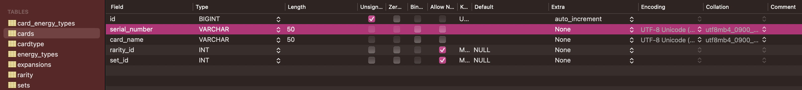
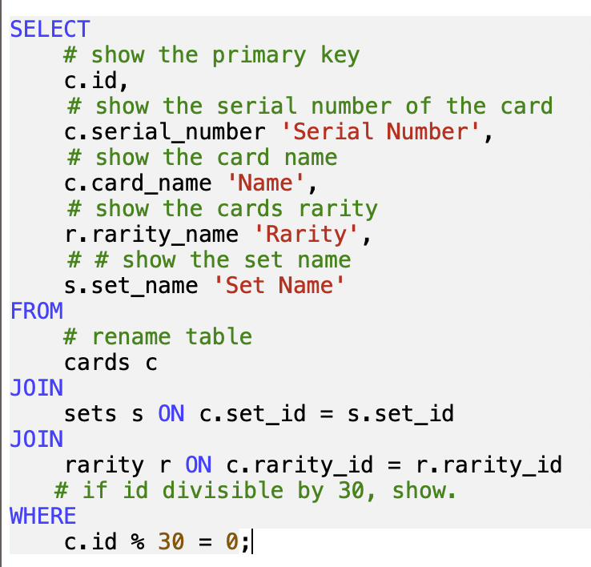
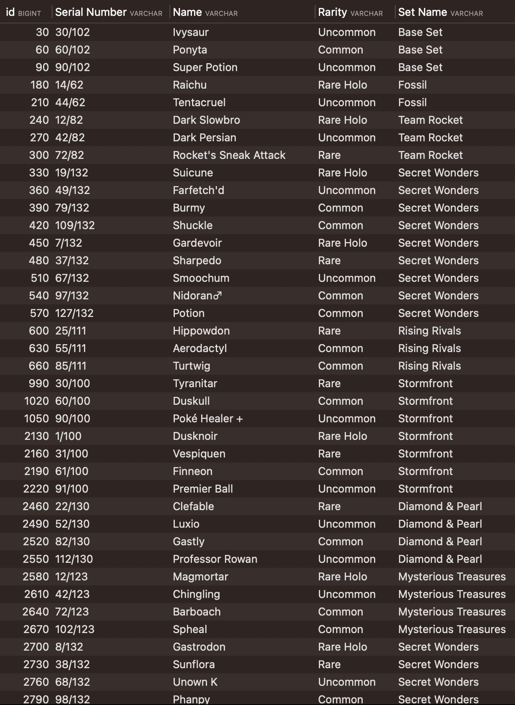

# Building a SQL Database 💾

## Introduction 📝

In this project, the goal is to create a new SQL database using MySQL and Sequel Ace, focusing on the fundamental concepts of primary keys, foreign keys, and best practices for Relational Database Management Systems (RDBMS). The chosen example for this project is the Pokemon Trading Card Game, providing a concrete context for understanding and implementing these important database concepts.

## Scraping Information 🕸️

The first step involves scraping information from the [Bulbapedia](https://bulbapedia.bulbagarden.net/wiki/Main_Page) website. The target is to retrieve specific data to be stored in the SQL database. Selenium and BeautifulSoup are used for web scraping, exploring the website, finding valuable data, and extracting the required information.

KEY FILES;

*[data-scrape-and-initial-dataframe.ipynb](https://github.com/brandontnavarrete/Building-SQL-Database/blob/main/data-scrape-and-initial-dataframe.ipynb)

*[refine-scrape-method.ipynb](https://github.com/brandontnavarrete/Building-SQL-Database/blob/main/refine-scrape-method.ipynb)

## Table Creation and Relationship Definition 🗃️

After scraping the necessary data, tables are created in SQL using the MySQL language. The tables are designed to store the scraped information, and relationships between the tables are established to represent connections and dependencies between different entities in the database. 



The following tables are created:

- 🧩 `card_energy_types`: Stores the energy types associated with each card.
- 🎴 `cards`: Holds information about each individual card, including its serial number, name, rarity, and set.
-  `cardtype`: Contains the types of each card (e.g., "Pokémon", "Trainer", "Energy").
- ⚡ `energy_types`: Stores the different types of energy cards.
- 🌟 `expansions`: Stores information about the different expansions in the Pokemon Trading Card Game.
-  `rarity`: Contains information about the rarity levels of cards.
- 📚 `sets`: Stores information about the different sets in the Pokemon Trading Card Game.

Primary keys and foreign keys are used to establish relationships between the tables, ensuring data integrity and enabling efficient querying.

## Connecting SQL Database to Python 🐍

To integrate the SQL database with Python, a connection is established between the two. The Python `mysql.connector` module is used to connect to the SQL database and transfer data from the scraped information. Queries are executed in Python, allowing for seamless interaction with the SQL database and retrieval of desired information.

The connection to the SQL server is established using the following code snippet:

```python
import mysql.connector

connection = mysql.connector.connect(
    host='localhost',
    user=username,
    password=password,
    database='PokemonTCG'
)
```

Once the connection is established, a script is created to send the scraped information from a dataframe to the corresponding tables in the SQL database. The script sends the serial number, card name, rarity, and set information to their respective tables.

After a given query:



These `join` query results show a better user-friendly table view.


You find that there are null values. This is due to not preemptively filling out the expansion and set names entirely. During the Python to SQL move, the names were not found 
in the tables to be added.

## Conclusion 🎉

This project aims to document the process of learning and creating an SQL database. By scraping data from a website, defining table relationships, and connecting the SQL database to Python, a comprehensive understanding of the database creation process is achieved. This README serves as a guide for anyone interested in exploring the steps taken to learn and create an SQL database using MySQL and Python.
